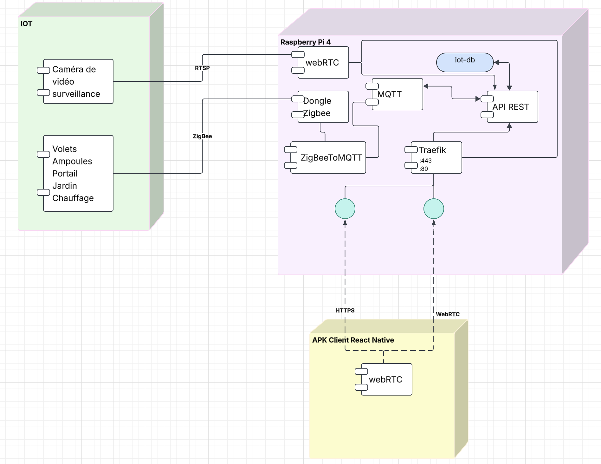
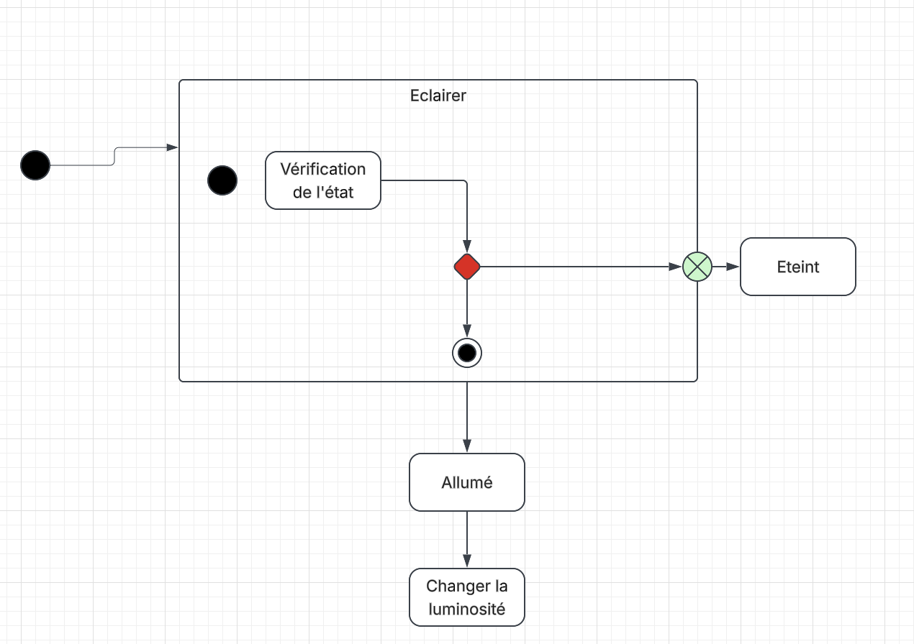
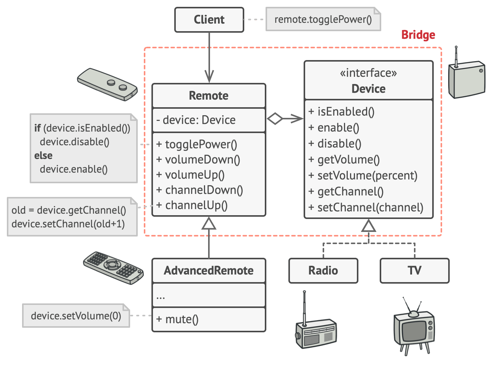
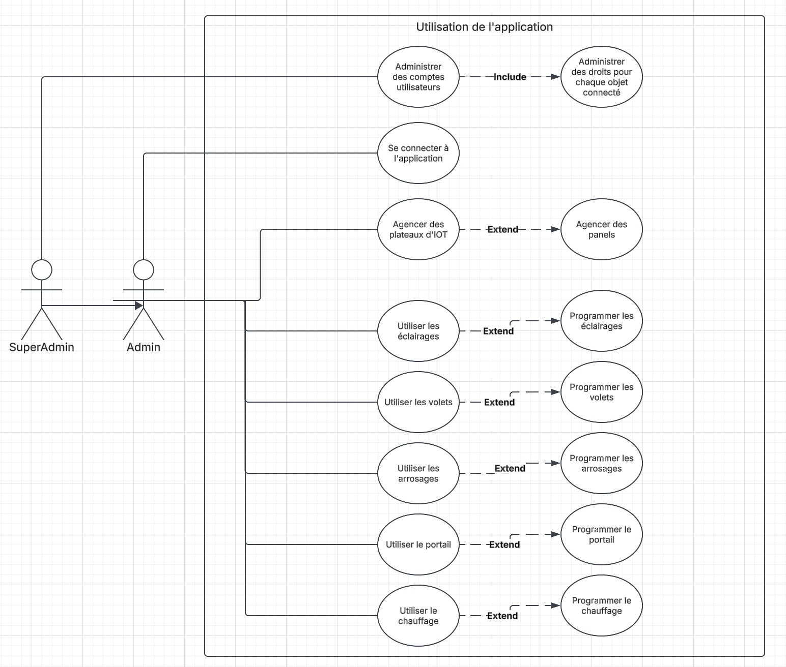
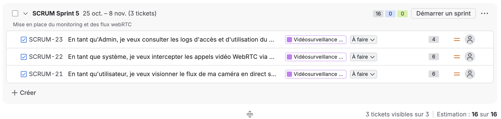

# UML 

## Diagramme de déploiement

L'IoT est relié au Raspberry PI 4 qui est l'hébergeur central de l'application.

Les caméras de surveillance communiquent en RTSP pour pouvoir atteindre un flux transmissible en WebRTC pour l'application mobile. 

L'IoT peut atteindre la stack à travers le Dongle ZigBee qui est le matériel chargé de recueillir les connexions utilisant le protocole de communication ZigBee. Les communications interceptées seront directement renvoyées au serveur ZigBee2MQTT afin de pouvoir exploiter les informations en JSON. Celles-ci seront stockées dans le serveur (Broker) MQTT. L'API REST pourra à son tour consommer les informations contenues dans les topics du serveur MQTT et émettre des instructions pour reconfigurer les appareils IoT en parcourant le sens inverse à travers tous les composants évoqués précédemment. 

Enfin, l'API REST stockera le monitoring du flux WebRTC pour historiser les accès ainsi que les commandes et configurations récurrentes effectuées sur l'API REST.

Le parcours de ces données est sécurisé à travers le serveur HTTPS Traefik et exposé pour l'application React Native.

## Diagrammes d'état-transition (Activité)

Voici le cycle de vie qui a lieu durant l'allumage ou l'extinction d'une ou plusieurs ampoules.

Le système vérifie l'état d'un éclairage pour proposer la commande inverse et ainsi permuter son état. S'il s'agit d'un éclairage et que l'ampoule réagit aux variations de luminosité, elle passera par l'état optionnel : changer la luminosité. 

Ce procédé fonctionne par la gestion de signaux industrialisés du matériel connecté. Il s'agira seulement d'utiliser le bon signal plutôt que de le programmer entièrement.

Voici un exemple connu du site refactoring.guru permettant de mieux comprendre l'implémentation industrielle des matériels entre eux, sans avoir besoin de connaître leur implémentation pour être utilisé à travers divers scénarios :

### Design pattern Bridge

Les volets devront pouvoir être fermés ou bien ouverts si l'on appuie sur le bouton stop, ou bien si l'on décide d'un pourcentage de fermeture ou d'ouverture.

## Cas d'utilisation

L'administration des droits est obligatoire pour chaque nouveau compte. En fonction de ses droits, l'Admin aura accès à certains objets connectés et à leur programmation dans le temps.

> **Note d'évolution :** Il y a une petite erreur sur les `extends` dans le schéma ci-dessus, les flèches devraient pointer dans l'autre sens, vers le premier cas d'utilisation (de l'option vers l'action de base).

## Planning Agile (Sprints de 2 semaines)

