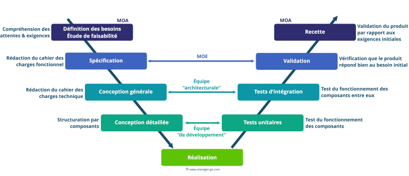
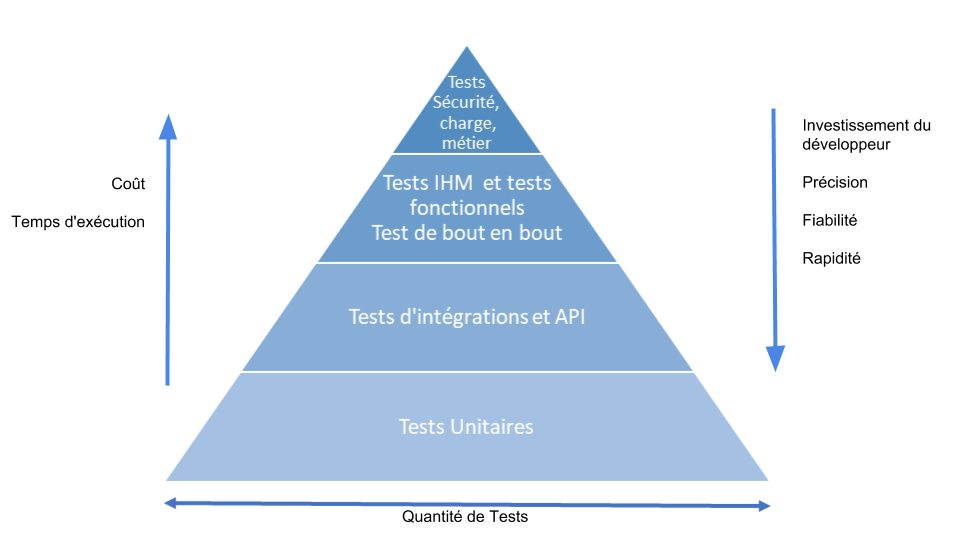

### Organisation et Pilotage du Projet

Afin d'assurer une forte qualité logiciel dans le domaine critique des objets connecté dans la domotique, nous allons travailler en extreme programming. Cela implique différentes étapes dans la conception et la réalisation des tâches à venir. 

Le rythme de rencontre avec le client est organisé sur un cycle de 2 semaines

#### Répartition des rôles:
- Développeur back-end
- Développeur Front-end 
- Designer UX/UI
- Testeur QA

#### Workflow en Extreme Programming. 
Etant donné que nous intervenons sur des protocoles réseaux particuliers nous n'allons pas travailler en Agile Scrum mais plutôt en Agile Extreme Programming afin de s'assurer que nous avançons sans aucun bug et avec une très bonne compréhension globale du projet et des composants développés.
- Le Client (entreprise de domotique) en réunion avec le reste de l'équipe de développement devra valider la conception des User stories qui seront la base principale pour exécuter les tâches de développement. Le testeur QA en collaboration avec le développeur backend et parfois le développeur frontend sur les fonctionnalités correspondantes, auront la charge de rédiger des scénarios en Gherkins en Behavior-Driven Development pour chaque user story, et en complément d'une definition of done.
- En terme de conception il faudra s'en tenir strictement à la portée des tâches qui vous seront attribuées et ne jamais anticiper le travail futur sur vos tâches actuelles. C'est comme cela que nous pourront nous assurer de la validité de chaque tâches sans créer du désordre.
- Les développeurs devront travailler en binôme (Pair programming) afin de s'assurer de la validité de la conception et de la réalisation du code. Les bugs devront se résoudre en équipe. Tout le développement devra être piloté par les Tests (Test-Driven Development - TDD) et respectent des normes de codage strictes. Les scénario Gherkins vous guideront sur le TDD pour connaître les cas de tests à développer
- A chaque avancée nous exécuteront les tests unitaires ainsi que les tests d'acceptations pour valider la non régression du code
- Si certains tests sont invalidés, les développeurs devront les retravailler. Cela sera établis après une réunion rassemblant l'équipe afin d'établir un planning et revoir les priorités des tâches à venir
- Après la validation des tests unitaires et d'acceptations, le code doit être livré en continue et fusionné. Cela permettra de remonter plus haut dans les tests de validations ainsi que d'observer l'assemblage de l'application avec le client.
- Chaque nouvelle réunion avec le client mènera à un nouveau cycle de travail reprenant tous les points précédents

### Stratégie de tests

La stratégie de test est présente pour répondre aux attentes de la qualité logiciel induite par le modèle du cycle en V. Chaque étape de conception et de réalisation devra correspondre a un type de test permettant de valider la qualité logiciel attendu. 

Modèle de développement - Extreme programming

Chaque étape du projet devra correspondre à un certains niveau de tests. Aussi, l'assemblage d'un cumul de petits composant devra donner lieux a des tests fonctionnels, puis end2end et enfin de charge et de sécurité. Ce qui rend le Peer Programming d'autant plus important car il faudra s'assurer de ne jamais rien oublier à la fois dans le déploiement des fonctionnalités et leur dépendances. C'est ainsi que nous assurerons qualité logiciel en testant tous les cas possibles et en ne cassant jamais la chaîne d'assemblage des composants.

Chaque cycle de test devra donner lieu a un cahier des recettes.

### Template du cahier des recettes :

#### 1. Sélectionner une exigence
- Rappeler les spécificitées fonctionnelles auxquels elles se rapportent.
- Rappeler les spécificités techniques qui seront abordées au cours du développement.
- Expliquer pourquoi ce cahier de test est rédigé et à quel(s) niveau(x) de test(s) il va répondre. 

#### 2. Environnement de Test
*   **Version de l'API (Backend Go) :** vX.X.X
*   **Version de l'App (React Native) :** vX.X.X
*   **Équipements IoT connectés :** 
    *   1x Clé Sonoff Zigbee 3.0
    *   Lister les équipements de test : ex. 1x Ampoule Zigbee, 1x Caméra IP RTSP
*   **Réseau :** Testé en local (WiFi) et en distant (4G via Traefik / Port 443).

#### 3. Cahier des recettes
*Vue d'ensemble de la couverture de test.*

| ID Exigence  | Description Spécification            | ID Test | Status    | Raison de l'echec |
| :----------- | :----------------------------------- | :------ | :-------- | ----------------- |
| **SF-1.1**   | Connexion sécurisée de l'utilisateur | UAT-001 | a tester/ |                   |
| **SF-5.1**   | Gestion des volets (pourcentage)     | UAT-002 | validé    |                   |
| **ST-2.1.3** | Authentification JWT / RBAC          | UAT-003 | echoué    |                   |

#### 4. Fiches de Tests d'Acceptation (UAT user acceptance test)

##### Test UAT-001 : Authentification de l'utilisateur
*   **Exigence liée :** SF-1.1 / ST-2.1.3
*   **Type de test :** End-to-End (Application Mobile)
*   **Pré-requis :** L'application est installée sur le smartphone, la base de données PostgreSQL contient un utilisateur actif avec les identifiants `admin@domotique.local` / `Password123!`.

**Scénario Gherkin (BDD) :**
> **Étant donné que** je suis sur l'écran d'authentification de l'application mobile
> **Quand** je saisis l'email "admin@domotique.local" et le mot de passe "Password123!"
> **Et** que j'appuie sur le bouton "Se connecter"
> **Alors** je suis redirigé vers mon plateau principal
> **Et** un token JWT est stocké de manière sécurisée sur le téléphone.

**Étapes d'exécution :**
1. Lancer l'application React Native.
2. Entrer l'email et le mot de passe.
3. Cliquer sur "Se connecter".

**Résultat de l'exécution :**
*   [ ] **Pass** (Succès)
*   [ ] **Fail** (Échec)
*   [ ] **Blocked** (Bloqué)
*   **Date d'exécution :** [Date]
*   **Commentaires / Bugs relevés :** *[Ajouter des notes si échec, ex: "Le bouton de connexion ne réagit pas sur iOS."]*

##### Test UAT-002 : Contrôle d'ouverture d'un volet électrique
*   **Exigence liée :** SF-5.1
*   **Type de test :** End-to-End (Matériel & Logiciel)
*   **Pré-requis :** L'utilisateur est connecté, un volet connecté est appairé sur Zigbee2MQTT et assigné au panel de l'utilisateur.

**Scénario Gherkin (BDD) :**
> **Étant donné que** je suis sur le panel de gestion du "Salon"
> **Quand** je règle le curseur (slider) du volet sur "50%"
> **Alors** l'application affiche l'état "En mouvement"
> **Et** le volet physique s'arrête exactement à la moitié de sa course.

**Étapes d'exécution :**
1. Naviguer sur le panel "Salon".
2. Glisser le slider du volet de 0% à 50%.
3. Observer l'interface et le comportement du relais physique.

**Résultat de l'exécution :**
*   [ ] **Pass** 
*   [ ] **Fail** 
*   [ ] **Blocked** 
*   **Date d'exécution :** [Date]
*   **Commentaires / Bugs relevés :** *[...]*

---

#### 5. Bilan et Signatures

**Résumé de la campagne de tests :**
*   Total des tests : [X]
*   Tests réussis : [X]
*   Tests échoués : [X]
*   Taux de succès : [X]%

**Décision de Release (Go / No-Go) :** [ ] GO / [ ] NO-GO